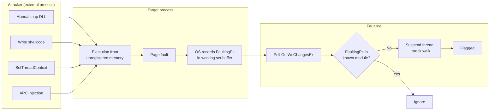

# Faultline

An anticheat proof of concept that detects execution from manually mapped memory by monitoring working set page faults and walking the call stack of suspicious threads.

## How it works

Windows tracks page faults per process through the working set watch API (`InitializeProcessForWsWatch` / `GetWsChangesEx`). Every time a page is brought into the working set, the OS records the instruction pointer (`FaultingPc`) that triggered the fault.

Faultline polls these events, checks whether each `FaultingPc` falls within a known loaded module, and flags execution from memory regions that are executable but not backed by any module in the PEB. When a suspicious fault is detected, the faulting thread is suspended and its stack is walked to capture the full call chain.

This catches code that was injected via manual mapping, shellcode injection, or similar techniques where the executable memory is never registered with the Windows loader.

A naive mapper trips the event path on the first execute. A smarter mapper allocates `PAGE_READWRITE`, populates pages via `WriteProcessMemory` (kernel-serviced, no user-mode `FaultingPc`) and flips to `PAGE_EXECUTE_READ` afterward, so the first execute never soft-faults. Faultline also polls `QueryWorkingSet` -- sibling of `GetWsChangesEx` in the same working-set API -- and flags any resident executable page outside every loaded module. Private pre-paged regions show up here even though no fault event was ever recorded for them.

## Catching thread hijacks from usermode

This also covers thread hijacking. If an external process redirects a thread via `SetThreadContext` / `NtSetContextThread`, APC injection, or similar into injected memory, the page fault still fires. The `FaultingPc` still lands outside any known module, and faultline catches it.

What's actually being detected is the side effect: execution from memory that isn't backed by a loaded module, not the redirection itself. There's no kernel callback for context changes, and ETW can trace the relevant syscalls but that's indirect at best. Faultline skips the interception problem entirely and just watches where threads end up executing. If it's unregistered memory and it faults a page, it's visible.

## Components

| Directory  | Description |
|------------|-------------|
| `anticheat/`  | Core detection DLL. Monitors working set faults, classifies memory regions, walks stacks |
| `host/`    | Minimal target process that loads the detection DLL |
| `injector/`| Manual mapper that injects the test payload into the host process |
| `payload/` | Test DLL that executes from manually mapped memory to trigger detection |
| `shared/`  | Common headers (logger, RAII handles, utilities) |

## Usage

1. Start `host.exe`
2. Run `injector.exe` in a separate terminal
3. The host console will log any detected suspicious execution along with stack traces

The injector supports two modes:

- **Remote thread** (default): `injector.exe` creates a new thread in the host via `CreateRemoteThread`
- **Thread hijack**: `injector.exe --hijack` redirects an existing host thread via `SetThreadContext`

Both trigger detection, but the host runs a background game loop thread that serves as the hijack target

## Demo

https://github.com/user-attachments/assets/333cd0b7-32e7-4dbb-8cbe-7b2b7125527e

## Limitations

- The event path (`GetWsChangesEx`) only fires on in-process-instruction faults -- cross-process writes and other kernel-initiated page-ins don't appear in its buffer. The snapshot path (`QueryWorkingSet`) compensates, but it can only flag regions that are resident *and* currently executable at poll time.
- Detection is reactive. By the time the fault is observed, the injected code has already run.
- Code caves or patches within legitimate modules will not be caught since the `FaultingPc` resolves to a known module range.
- The poll-based design means short lived threads may exit before a stack walk can be performed.
- Module stomping (writing code into an unused section of a legitimately-loaded DLL) is not caught. The `FaultingPc` and the current per-page protection both resolve inside a known module range; Faultline trusts that range.
- `EnumProcessModules` reads the PEB loader list. An injected payload that forges an `LDR_DATA_TABLE_ENTRY` for its own region makes itself look like a loaded module, and every subsequent check treats it as known.
- Both paths run in the target's address space with the same privileges as the payload. An in-process attacker can unload the DLL, patch `Running`, hook `GetWsChangesEx` / `QueryWorkingSet`, or drain the WS buffer before Faultline polls.
- Kernel-mode or hypervisor-resident cheats can dispatch without ever faulting a user-mode VA, or clear the `EPROCESS` working-set-watch state directly. Usermode working-set signals go dark.
- The snapshot path intentionally skips `MEM_IMAGE` pages to avoid racing the loader during DLL load. Cheats that manually map via `NtCreateSection(SEC_IMAGE)` land as `MEM_IMAGE` and won't be flagged without hash or path verification of the backing file.
